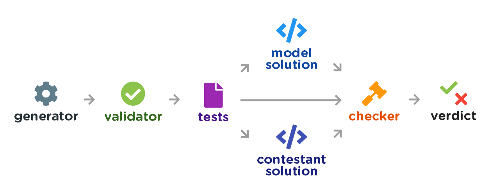
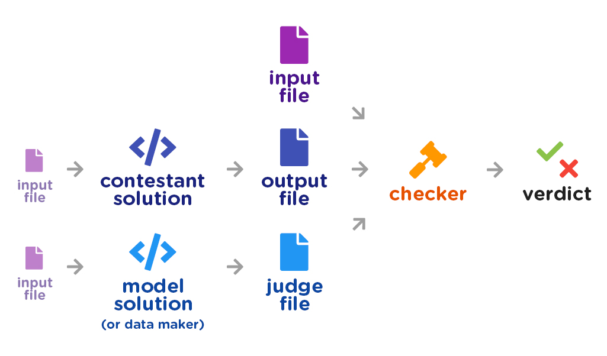

<!-- NOTE TO CONTRIBUTORS: PLEASE DON'T EDIT THIS FILE. -->
<!-- Edit docs/src/TUTORIAL.md instead, then run 'docs/src/makedocs'. -->


This is a tutorial on how to prepare problems from scratch using KompGen. We'll work through what I did to prepare the [NOI.PH 2019 Finals Practice Round](https://hackerrank.com/contests/noi-ph-2019-finals-practice) together. (I prepared all the problems except Bato Bato Split.) While doing so, we'll go over many of the features of KompGen that you'll use during problemsetting.

I'll assume you have `kg` installed in your system. You can check this by typing `kg` in the terminal, which should pop up a message like this:
```bash
$ kg
usage: kg [-h] [-krazy]
          {konvert,convert,konvert-sequence,convert-sequence,subtasks,gen,test,
          run,make,joke,init,kompile,compile,kontest,contest,seating,passwords}
          ...
kg: error: the following arguments are required: main_command
```

If you don't get a message like this, check out the Setup header in the README.

I'll also assume some proficiency with [Python](https://docs.python.org/3/tutorial/), as we'll work exclusively in Python throughout this tutorial. (It's possible to use different languages, but if you're using KompGen in the first place, you're probably interested in doing everything in Python anyway.) I'll try not to use anything too magical in Python, and stick to basic language functions.

To avoid any issues later on, if you're using Windows, I'll strongly recommend you [install Gow](https://github.com/bmatzelle/gow/wiki) if you haven't yet. It will give you some useful programs like `cat` or `diff`. (If you don't know what these are, don't worry about it.)

It should take about 60 to 90 minutes to read and follow the whole tutorial. Reading the overview should take around 5 minutes. Then there's one section for each of the problems Mystery Function, Sharing Chocolates 7, Totally Not Robots, and City Map, each of which should take around 15–20 minutes to read and follow on your computer. The final section of this file will simply discuss more advanced features of KompGen, and should take around 5 minutes to read.


# Overview

The process of making a programming problem is called *problemsetting*, or simply *setting*. Setting a problem involves writing several different files: the statement, the validator, generators, the checker, the model solution, and so on. In this section, I'll introduce what each of these are and what they do.

## The model solution and the checker

I'll assume you're familiar with the way that solutions to competitive programming problems are judged. As a reminder, the way a solution to a (typical, non-interactive) problem is judged works like this:

1. The contestant's *solution* is run over several *test cases*.

2. The contestant's output for each case is compared to the output of the *model solution* by a program called the *checker*.

3. The checker determines whether the contestant's output is correct.

This introduces us to our first two programs. The first is the **model solution**. As the name suggests, it's the solution that a contestant's solution is compared against. The programs aren't directly compared, but their outputs are. Sometimes, this is also called the *judge solution*.

The second is the **checker**. For most problems, the checker will simply determine if the outputs of the contestant and the model solution are the same. You may also be familiar that when the answer is a float, an answer is accepted if its absolute or relative error is within certain bounds&mdash;this is also handled by the checker. For problems with multiple possible solutions, it's also the checker that determines whether a contestant's output is correct.

## Strong test cases and generators

This leads us to the next question: how are test cases written? You're probably familiar, or at least have heard of, the difference between *weak* test cases and *strong* test cases. The aim of test cases are to rule out wrong and slow solutions. Test cases that are *strong* do this well:

- They include *large* test cases that a slow solution would exceed the time limit on, but which a correct solution would pass. Ideally, these should be written in a way that solutions with the correct time complexity but a large constant should still pass, but heavily-optimized solutions with a slower time complexity should fail.

- They include *tricky* test cases that a wrong solution would produce the wrong answer for, but which a correct solution would pass. These test cases should catch common mistakes, like off-by-one errors, stack overflows, incorrect binary searches, or tricky edge cases.

We see that strong test cases fall into two types: *large* and *tricky*. Strong test cases include both large and tricky test cases. It's also usually a good idea to also include some smaller test cases, in order to quickly rule out incorrect solutions.

Good test cases also have a limited number of them. While it's possible to simply put all possible inputs as test cases, this often requires making a huge amount of test cases. Problems typically have less than one hundred or so test cases, and the total size of all input should be a few dozen megabytes at most.

On the other hand, weak test cases are those that aren't strong. For example, if all the test cases for a problem are made by hand, then this is very likely to produce weak test cases. Purely random test cases are often weak as well, since they won't include large or tricky test cases.

As you can probably guess, **the hardest and most important part in problemsetting is writing strong test cases**. This is tricky because they need to be strong, and yet they need to be limited. The easiest way to accomplish this is not to write these test cases by hand, but by using programs called *generators*.

This introduces us to our next program: **generators**. Generators are programs that make test data. Note how I used the plural *generators*. Usually, there would be one generator for each kind of test case: random test cases, tricky test cases, edge cases, test cases with specific patterns, and so on.

## The validator

If you've joined a Codeforces round and have participated in the hacking phase, then you should know the process for hacking:

1. You read a contestant's solution and come up with a test case.

2. The test case is checked if it matches the input format for the problem by a program called the *validator*.

3. The contestant's solution is run on this test case, and its output is compared to the model solution by the checker.

This introduces us to our last program: the **validator**. The validator is a program that reads in a file and check if it follows the input format given in the problem statement. It should also be very strict in doing so: it should check that there is no extra whitespace, or even extra blank lines.

You may think that a validator is only necessary when writing problems for Codeforces, but *it's important to write a validator for **every** problem*. This is because in the KompGen model, all test cases made by a generator are run through the validator in order to check if they're valid. This ensures that invalid test data does not appear during the contest.

In the KompGen model, the validator is also used to detect subtasks, which is useful so you don't have to assign subtasks yourself.

## The statement

Finally, you should also remember to write the **statement**. This consists of the problem statement, the input and output format, the constraints and scoring, and some sample test cases.

By now, you should be familiar with what separates good statements from bad ones. Good statements are clear and unambiguous, carefully defining everything stated. Here are some examples of sentences that shouldn't appear in a good statement, lifted from the NOI.PH's document *Preparing Programming Contests Essentials*:

- *The piece can move one step in the two-dimensional grid.* Which directions are allowed for one step? Can the piece move one step diagonally? What happens at the edges of the grid: can the piece move out of the grid?

- *Jennifer must sit to the right of Geniefer.* Must Jennifer sit immediately next to Geniefer? Can she sit a few seats away, as long as the seat is to Geniefer's right?

- *Output the longest string satisfying the constraints above.* The word *the* implies that there's only one such longest string. What if there are multiple longest strings? Or are we guaranteed that there's only one such longest string?

- *The input contains the three integers mentioned in the problem statement.* Which three integers? How are they ordered in the input? Are they given in a single line, or each in a separate line? Are they separated by spaces, commas, or what?

It can be a bit tricky, starting out, getting the problem statement right, especially the input and output formats. We'll talk about ways to write a good statement later on.

## Putting it all together

Phew, that's a lot of stuff! Let's review:

- The **statement** specifies the problem.

- The **generators** make the test cases for the problem.

- The **validator** checks if these test cases follow the input format.

- The **model solution** gives the correct answers to each test case.

- The **checker** checks if a contestant's output is correct.

This is neatly summarized in the following picture:



We introduced these five files in the order of checker, model solution, generator, validator, and statement. For this tutorial, we will write these files *in the reverse order*, although it's possible to write these in any order. This means that the process of making a problem is:

1. Write a clear **statement**.

2. Write a **validator** according to the input format and constraints in the statement.

3. Write **generators** that make the test data for the program. This step is typically the hardest part of problemsetting.

4. Write a **model solution**, and be very careful to make sure it's correct.

5. Use one of the default **checkers**, or write your own.

Now that you know how a problem is written, let's set our first problem using KompGen!


# Mystery Function

First, let's set the problem [Mystery Function](https://www.hackerrank.com/contests/noi-ph-2019-finals-practice/challenges/mystery-function). Although it's not the easiest problem in the round, it's the easiest problem to set, because the test data is very simple. I recommend you follow along with the commands on your computer, so that you can see how KompGen works.

## Writing the statement

NOI.PH problems have a template for statements that's different from the one that KompGen (currently) makes, so we'll use this template instead. Here's a very bare statement that illustrates this:

```tex
Title: Mystery Function  
Slug: mystery-function  
Description: ?  
Author: Kevin  


\section{Statement}

You are given an integer $n$. If $n \ge 1$, output $n^3 + n^2 + n + 1$. 
Otherwise, output \texttt{NONE}.


\section{Input Format}

The first line of input contains $t$, the number of test cases.

Each test case consists of one line containing a single integer, $n$.


\section{Output Format}

For each test case, output one line containing the answer to that test case.


\section{Scoring}

\textbf{For all subtasks}

$1 \le t \le 10^5$

\textbf{Subtask 1} (20 points):

$n \in \{1, 2, 3, 69, 420\}$  

\textbf{Subtask 2} (20 points):

$|n| < 10^3$

\textbf{Subtask 3} (60 points):

$|n| < 10^5$


\section{Sample Input}

    1
    1


\section{Sample Output}

    4


\section{Notes}

We have $n = 1$. Hence we output $1^3 + 1^2 + 1 + 1 = 4$.
```

We save this in a file called `statement.tex`. The `.tex` is for [LaTeX](https://www.nyu.edu/projects/beber/files/Chang_LaTeX_sheet.pdf). When problems in the NOI.PH Scientific Committee are at the idea stage, we usually pass around statement files like these.

Observe how carefully the input and output formats are specified. For this problem, it's pretty easy to write the input format: this is the typical template used for input with test cases. Generally, when writing input formats, I just modify the input format from an existing NOI.PH problem. The same goes for output formats.

The only thing here that might not be obvious are the *slug* and *description*. In a HackerRank URL to a problem, the thing that comes after the last slash is called the *slug*. It consists of only lowercase English letters, numbers, and hyphens. We typically also leave the description blank.

<!-- TODO i kinda want to write a better cheatsheet than the linked one. https://math.meta.stackexchange.com/questions/5020/mathjax-basic-tutorial-and-quick-reference might be a good reference. -->

<!-- TODO To help with writing input and output formats, some templates can be found in `STATEMENTS.md`. -->

## Initializing, and details.json

Open your terminal somewhere you're fine putting files in and run the command
```bash
$ kg init mystery-function --subtasks=3
```

Here, `mystery-function` is the slug and `3` is the number of subtasks. Don't worry about getting the number of subtasks right: we can always change it later.

The command makes a folder called `mystery-function` inside the current folder. There will be a bunch of automatically generated files: don't worry too much about these. For now, get rid of the generated `statement.md` and replace it with the `statement.tex` we wrote previously.

Open the file `details.json`. This file is what KompGen uses to determine which files in the folder are which. Whenever you add a new file, you typically want to add it to `details.json` as well. Most of the fields here should be self-explanatory: you have the title, the model solution, the validator, the generators, and the list of subtasks. Don't worry about any of the other fields for now.

The default `details.json` here is fine. Usually I'd change the `title` field, but in this case KompGen is smart enough to figure out the title is "Mystery Function". Let's leave it alone for now, and write the validator!

## Writing the validator

Open the file `validator.py`. You should see a file that looks like:

```python
from sys import *
from kg.validators import * ### @import

bounds = {
    't': 1 <= +Var <= 10**5,
    'n': 1 <= +Var <= 10**5,
}

subtasks = {
    '1': {},
    '2': {},
    '3': {},
}

@validator(bounds=bounds, subtasks=subtasks)
def validate_file(file, subtask=None, *, lim):

    ... # write your validator here

    # file .read_int(), .read_ints(), .read_space(), .read_eoln(), etc.
    # file.read_eof()
    

if __name__ == '__main__':
    validate_or_detect_subtasks(validate_file, subtasks, stdin)
```

We won't touch the header, which inputs the required stuff from KompGen. We also won't touch anything after `if __name__ == '__main__':`, so don't worry about it.

First, let's specify the constraints on `t` and `n`, by changing `bounds` and `subtasks`:

```python
bounds = {
    't': 1 <= +Var <= 10**5,
    'n': -10**5 < +Var < 10**5,
}

subtasks = {
    '1': {},
    '2': { 'n': -10**3 < +Var < 10**3 },
    '3': { 'n': -10**5 < +Var < 10**5 },
}
```

Here, `bounds` should have the constraints for the variables across all subtasks, and `subtasks` should have any additional constraints. Currently, KompGen doesn't support `or` here. We can't write something like

```python
# doesn't work:
'n': +Var == 1 or +Var == 2  or +Var == 3 or +Var == 69 or +Var == 420
```

So we'll just have to check the bounds for subtask 1 later.

Second, let's write the function `validate_file`, which reads the input format very strictly. To write it, we simply convert each line of the input format. For example, if a line has "three space-separated integers x, y, z", then we write

```python
[x, y, z] = file.read.int(lim.x).space.int(lim.y).space.int(lim.z).eoln
```

The read integers are then placed in `x`, `y`, and `z` if we need to use them later on in the function. Note how everything here is specified, including the whitespace.

More specifically, `int(lim.x)` reads an integer and checks if it follows the limits for `x`, specified in both `bounds` and `subtasks`. Then `space` reads a space, `int(lim.y)` reads another integer, and so on. The `eoln` reads the end of line.

For this problem, our `validate_file` function will look like

```python
@validator(bounds=bounds, subtasks=subtasks)
def validate_file(file, subtask=None, *, lim):

    [t] = file.read.int(lim.t).eoln
    for cas in range(t):
        [n] = file.read.int(lim.n).eoln

    [] = file.read.eof
```

The `eof` here is the end of file: remember to read it as well! Observe how the left side is always enclosed in a list, even if it's a single variable or if it's empty. Don't worry about the first three lines of the function: what's important is how the input is read.

Note how the limits on `t` and `n` are magically checked when we do `int(lim.t)` and `int(lim.n)`. However, as we noted earlier, we still have to check that `n` is one of 1, 2, 3, 69, 420 for the first subtask. To do this, we can use the function `ensure`, which is like `assert` in C++:

```python
@validator(bounds=bounds, subtasks=subtasks)
def validate_file(file, subtask=None, *, lim):

    [t] = file.read.int(lim.t).eoln
    for cas in range(t):
        [n] = file.read.int(lim.n).eoln
        if subtask == '1':
            ensure(n == 1 or n == 2 or n == 3 or n == 69 or n == 420)

    [] = file.read.eof
```

Put it all together and we've got our validator!

```python
from sys import *
from kg.validators import * ### @import

bounds = {
    't': 1 <= +Var <= 10**5,
    'n': -10**5 < +Var < 10**5,
}

subtasks = {
    '1': {},
    '2': { 'n': -10**3 < +Var < 10**3 },
    '3': { 'n': -10**5 < +Var < 10**5 },
}

@validator(bounds=bounds, subtasks=subtasks)
def validate_file(file, subtask=None, *, lim):

    [t] = file.read.int(lim.t).eoln
    for cas in range(t):
        [n] = file.read.int(lim.n).eoln
        if subtask == '1':
            ensure(n == 1 or n == 2 or n == 3 or n == 69 or n == 420)

    [] = file.read.eof

if __name__ == '__main__':
    validate_or_detect_subtasks(validate_file, subtasks, stdin)
```

## The KompGen generator model

In the KompGen model, a generator is a program takes several parameters for input, and outputs something. This output is passed through the *formatter*, which takes the output and prints it to a file according to the input format. Then the *testscript* calls the generators several times.

Let me illustrate with a simple example. Here's a generator that takes two integers, `T` and `N`, and outputs `T` random integers from `1` to `N`, which is saved in a file called `gen_random.py`. You can ignore the header and the footer for now, just focus on the function `gen_random`:

```python
from sys import *
from kg.generators import * ### @import
from formatter import * ### @import

def gen_random(rand, *args):
    T, N = map(int, args[:2])
    res = []
    for cas in range(T):
        res.append(rand.randint(1, N))
    return res

if __name__ == '__main__':
    write_to_file(print_to_file, gen_random, argv[1:], stdout)
```

<!-- TODO change to new write_to_file format, same with all the other files -->

Note that `gen_random` doesn't actually write to the file, it just outputs the integers to be written in the file. The output of `gen_random` will be something like `[5, 10, 2]`. The actual writing is done by the **formatter**, which is saved in a file called `formatter.py`:

```python
def print_to_file(file, cases):
    print(len(cases), file=file)
    for n in cases:
        print(n, file=file)
```

Here, the output of the function `gen_random` is passed as the variable `cases`. So if `gen_random` outputs `[5, 10, 2]`, the function `print_to_file` would print
```
3
5
10
2
```

That way, if we want to change the output format, we only have to edit the formatter, without having to edit any of the other files.

Now let's talk about testscripts. Recall that our generator is saved in a file called `gen_random.py`. If we want to use it to generate 3 integers between 1 and 10, we'd call it with:

```bash
$ gen_random.py 3 10 > tests/000.in
```

Here, the `3` and `10` are given as input, and become `T` and `N` in the function `gen_random`. But often you want to call `gen_random.py` multiple times, with different values of `T` and `N`. So you'd want to do something like

```bash
$ gen_random.py 3 10 > tests/000.in
$ gen_random.py 10 1000 > tests/001.in
$ gen_random.py 10 5000 > tests/002.in
$ gen_random.py 5 10000 > tests/003.in
```

This is a bit of a hassle, so there is a file that does this automatically. This file is called the **testscript**, which is saved in a file called `testscript`. The equivalent of the above would be:

```bash
gen_random 3 10 > $
gen_random 10 1000 > $
gen_random 10 5000 > $
gen_random 5 10000 > $
```

Note how there's no `.py` any more. Also note how we use a `$` instead of specifying the test case numbers manually, which is way more convenient. To recap:

- The **generator** generates a test case's data.

- The **formatter** takes the data and prints it to an input file.

- The **testscript** has a bunch of commands for running the generators.

Here's a nice picture that shows this:


## My first generator

Let's go back to the problem Mystery Function. For the sake of demonstration, we're going to make generators that output purely random input, which should be strong enough data for this very simple problem.

Let's decide that our generators will return a list of integers, one integer for each test case. Now that we've decided what our generators will return, we can write the formatter, which is the first thing we write when making test cases. Open `formatter.py` and change it to this:

```python
def print_to_file(file, cases):
    print(len(cases), file=file)
    for n in cases:
        print(n, file=file)
```

You may want to keep this file open in your text editor so you can refer to it when writing the generator. You can change the name of the function `print_to_file` if you want, but I recommend not doing so.

Rename `gen_random.py` to `gen_subtask1.py`. This file will generate the input for subtask 1. By KompGen convention, all generators must begin with the prefix `gen_`.

Open the new file `gen_subtask1.py`. Let's decide that it will take one integer for input, `T`, the number of test cases. Let's write the main function that will generate the integers:

```python
from sys import *
from kg.generators import * ### @import
from formatter import * ### @import

def gen_subtask1(rand, *args):
    T = int(args[0])
    res = []
    for cas in range(T):
        res.append(rand.choice([1, 2, 3, 69, 420]))
    return res

if __name__ == '__main__':
    write_to_file(print_to_file, gen_subtask1, argv[1:], stdout)
```

The line `T = int(args[0])`, takes in the integer `T` from the input. If you want to take multiple inputs, you can write something like `a, b, c = map(int, args[:3])`, making sure to change `3` with the number of inputs.

The line `res.append(rand.choice([1, 2, 3, 69, 420]))` appends a randomly chosen number from `[1, 2, 3, 69, 420]` to `res`. For randomness, you can use any function in [Python's random module](https://docs.python.org/3/library/random.html), but you have to remember to prefix it with `rand.`.

Note how in the last line, we changed `gen_random` to `gen_subtask1`, which is the name of the function that we wrote.

Now, open `testscript`. Remove everything and replace it with the single line

```bash
gen_subtask1 100000 > $
```

Now, let's make our test cases! With your terminal opened in the `mystery-function` folder containing all of our files, run the command

```bash
$ kg make inputs
```

It will throw an error. Thankfully, KompGen has very nice errors, and it tells us exactly what's wrong:

```
kg.script.testscripts.TestScriptError: Couldn't find program gen_subtask1
(from testscript). It should be in 'generators'
```

The issue here is that we haven't updated `details.json`. Remember that KompGen doesn't know a program exists unless it's in `details.json`, so whenever we make a new generator, we have to update that file. Open the file `details.json` and change `gen_random.py` to `gen_subtask1.py`:

```json
"generators": [
    "gen_subtask1.py"
],
```

Now, run the command `kg make inputs` again. It should make a single file `tests\000.in`. If you open it, you should see 

```
100000
3
420
1
2
3
3
69
420
3
...
```

### A note on reproducibility

Now wait a minute. If the test cases are being generated randomly, how do I know exactly what your file looks like? This is because the same generator and the same argument list, will always produce the same output. So if your testscript looks like:

```bash
gen_subtask1 100000 > $
gen_subtask1 100000 > $
gen_subtask1 100000 > $
```

then `kg make inputs` will just make the same input file three times. This is important so that the same KompGen source files always produce the same output, for consistency. (This is also why you should always use random functions by prefixing them with `rand.`, rather than using `from random import *`.)

To make the outputs actually different, we can just pass extra arguments:

```bash
gen_subtask1 100000 ignored1 > $
gen_subtask1 100000 ignored2 > $
gen_subtask1 100000 ignored3 > $
```

The generators ignore any extra arguments. But because the arguments are changed, a different random seed is generated, and the outputs are also changed.

## Another generator and sample input

Let's write the second generator, which we'll use for subtasks 2 and 3. It will take two inputs, `T` and `N`, where `T` is the number of test cases and `N` is the maximum absolute value of `n`.

To make sure the test cases are different, we're going to use the function `rand.shuffled`, which shuffles a list and returns a new list. (If you're familiar with `rand.shuffle`, this is slightly different, because `shuffle` shuffles an existing list and doesn't return anything. Think about the difference between `sorted(a)` and `a.sort()`.)

Duplicate the file `gen_subtask1.py`, and rename the duplicate `gen_random.py`. Since we made a new file, let's modify `details.json` to have:

```json
"generators": [
    "gen_subtask1.py",
    "gen_random.py"
],
```

Now open `gen_random.py`. Let's write it:

```python
from sys import *
from kg.generators import * ### @import
from formatter import * ### @import

def gen_random(rand, *args):
    T, N = map(int, args[:2])
    res = rand.shuffled(range(-N+1, N))
    while len(res) < T:
        res.append(rand.randint(-N+1, N-1))
    return res[:T]

if __name__ == '__main__':
    write_to_file(print_to_file, gen_random, argv[1:], stdout)
```

Again, since we changed the name of the function to `gen_random`, we also changed the last line to have `gen_random` as well. Then we open `testscript`, and change it to:

```bash
gen_subtask1 100000 > $
gen_random 100000 1000 > $
gen_random 100000 100000 > $
```

Now we run `kg make inputs` again. Inspect the inputs yourself to see if it has what you want. If not, then you can always edit the generators and testscript and run `kg make inputs` until you get what you want. This is the typical cycle when making test cases.

Finally, we write the sample input. Since this is written by hand, we won't use a generator for this. Instead, open the file `sample.in`, which should already exist, and change it to:

```
1
1
```

Then open `testscript` and change it to:

```bash
! cat sample.in > $
gen_subtask1 100000 > $
gen_random 100000 1000 > $
gen_random 100000 100000 > $
```

The `!` at the beginning of the line means "run this command as is". So the first line here takes the contents of `sample.in`, and the testscript puts it in the first input file. This is what the command `cat` does. If you don't know what `cat` does, for now, it's enough to remember that if you want to make input manually, use the format `! cat manual_input.in > $`.

Note that sample inputs should come before any of the other inputs in the problem. And with that, we're done making the generators!

## Writing the model solution and making all

The remaining steps are pretty easy: writing the model solution and the checker. The model solution is pretty short for this problem. Open `solution.py` and replace it with

```python
for cas in range(int(input())):
    n = int(input())
    if n >= 1:
        print(n**3 + n**2 + n + 1)
    else:
        print("NONE")
```

And then we choose the checker. In fact, for this problem, we don't have to do anything, since we're going to use the default checker. The default checker simply checks if the contestant's output is exactly the same as the model solution's output, which is what we want.

So we're actually done! Run the command

```bash
$ kg make all
```

and watch the magic happen. KompGen will use your testscript and generators to make the inputs for the problem, then use the model solution to generate the correct outputs, and finally use the validator to detect subtasks.

You can inspect the generated input and output yourself in the folder `tests`: the corresponding output to `000.in` is `000.ans`, for example. You can also inspect the detected subtasks by opening the file `subtasks.json`, which should look like:

```
[
    [0, 1, [1, 2, 3]],
    [2, 2, [2, 3]],
    [3, 3, [3]]
]
```

The second line means tests `0` through `1` are in subtasks `1`, `2`, and `3`. Something like `[10, 22, [2, 4]]` would mean tests `10`, `11`, `12`, and so on up to `22`, are all in subtasks `2` and `4` only, and not in any other subtask.

## Sharing your work

Suppose you want to upload your problem to [Polygon](https://polygon.codeforces.com), which is the platform NOI.PH currently uses to develop problems. After running `kg make all`, run the command

```bash
$ kg kompile
```

This should make a folder called `kgkompiled`. In it should be the folder `pg`. We will use this folder when uploading to Polygon.

First, login or register to Polygon. At the toolbar on top, click New Problem. Name the problem `mystery-function`, and then press Create. Then find the problem `mystery-function` in your list of problems, and click Start.

In the toolbar above, click Statement, choose English as a language, and press Create. Before typing anything, scroll down and check Show section 'Scoring'. Then fill in the problem statement by copying and pasting the fields in `statement.tex`, adding the name of the problem, the statement under Legend, the input and output formats, the constraints under Scoring, and the sample explanation under Notes. Then hit Save.

In the toolbar above, click Files. In the Source Files section, click Add Files, then Choose Files. Go to the folder `mystery-function/kgkompiled/pg` we have from earlier, and upload `gen_subtask1.py`, `gen_random.py`, and `validator.py`. Then click Add Files. (*Do not upload the files in `mystery-function`.* You always want to upload the files in `kgkompiled/pg`.)

In the toolbar above, click Checker. Select `ncmp.cpp` as the checker, and click Set checker. Then click Validator in the toolbar, select `validator.py`, and click Set validator.

In the toolbar above, click Tests. First you have to add in any tests that you do `! cat` in testscript, since Polygon doesn't support that. To add a test manually, click Add Test. Paste in the data in `sample.in`, then check Use in statements, and hit Create.

After making the sample test, click Tests in the above toolbar again. Open `testscript` (again, the one in `kgkompiled/pg`) and paste its contents below Script:. Then click Save Script. It is in the Tests tab that we can also set the scoring, but we won't do so now.

In the toolbar above, click Solution files. Click Add Solutions, then Choose Files. Upload `solution.py`, then click Add Files. To add other users who can see the problem, click Manage access in the above toolbar.

*Finally,* look at the lowest box in the right sidebar. Hit Commit Changes, and add a commit message. You probably want to check the Don't send email notification checkbox, which is somewhat customary in the NOI.PH Scientific Committee to avoid email spam. Then hit Commit!

<!-- TODO screenshots? -->

When sharing a problem you made in KompGen to others, it's typical to not include the `tests/` folder and the `kgkompiled/` folder, because these can be generated from the KompGen source files anyway. You can also delete these folders if you want to save space.


# Sharing Chocolates 7

Now, let's set the problem [Sharing Chocolates 7](https://www.hackerrank.com/contests/noi-ph-2019-finals-practice/challenges/sharing-chocolates-7). We'll get some more practice using KompGen, write a slightly more advanced validator, and talk about the evils of floating point.

## Statement and initialization

Here's the `statement.tex` we'll be using:

```tex
Title: Sharing Chocolates 7: The Force Equals Mass Times Acceleration  
Slug: sharing-chocolates-7  
Description: ?  
Author: Kevin  


\section{Statement}

Given two integers $F$ and $m$, output $\frac{F}{m}$.


\section{Input Format}

The first line of input contains $t$, the number of test cases.

Each test case consists of a single line containing two space-separated 
integers, $F$ and $m$.


\section{Output Format}

For each test case, output a single line containing a single real number equal 
to $\frac{F}{m}$. Your answer will be considered correct if it is within an 
absolute or relative error of $10^{-6}$ from the correct answer.  

\textit{Note:} Suppose the real answer is $r$, and your output is $s$. Then:

\begin{itemize}

\item The \textbf{absolute error} is defined as $|r - s|$.

\item The \textbf{relative error} is defined as the smaller number between 
$\frac{|r - s|}{|r|}$ and $\frac{|r - s|}{|s|}$. (If the denominator is $0$,
then we ignore it.)

\end{itemize}


\section{Scoring}

\textbf{For all subtasks}

$1 \le t \le 11111$

$1 \le F, m \le 10^9$

\textbf{Subtask 1} (20 points):

$1 \le F, m \le 5$

The answer is an integer.

\textbf{Subtask 2} (20 points):

$1 \le F, m \le 100$

The answer is an integer.

\textbf{Subtask 3} (20 points):

The answer is an integer.

\textbf{Subtask 4} (20 points):

$1 \le F, m \le 100$

\textbf{Subtask 5} (20 points):

No additional constraints.


\section{Sample Input}

    2
    2 1
    2 3


\section{Sample Output}

    2.000
    0.666666654321


\section{Notes}

For the second case, the exact answer is $0.666666\ldots$ repeating, but the 
given answer, $0.666666654321$, is accepted since the absolute error from the 
correct answer is $< 10^{-6}$.
```

The only thing here that might be a little tricky is the output format. Again, this is just a standard output format copied from one of the NOI.PH problems. When asking for an answer that's a real number, it's typical to ask for it to have a given absolute or relative error, and the typical number is $10^{-6}$.

Like last time, run the command

```bash
$ kg init sharing-chocolates-7 --subtasks=5
```

Then open `details.json`, change the title of the problem to "Sharing Chocolates 7: The Force Equals Mass Times Acceleration", and then get rid of the generated `statement.md` and replace it with `statement.tex`.

## Writing the validator

You can probably figure out how to write most of the validator yourself. The tricky part is checking whether the answer is an integer. As an exercise, try to write the validator for now ignoring this constraint, and compare your answer to mine. Open `validator.py`, maybe referring to the previous tutorial, and try to write the validator.

Ready? Here's the validator I wrote, without the header or footer. Yours might look a little different, but as long as it does the same thing, that's okay:

```python
bounds = {
    't': 1 <= +Var <= 11111,
    'F': 1 <= +Var <= 10**9,
    'm': 1 <= +Var <= 10**9,
}

subtasks = {
    '1': { 'F': 1 <= +Var <= 5, 'm': 1 <= +Var <= 5 },
    '2': { 'F': 1 <= +Var <= 100, 'm': 1 <= +Var <= 100 },
    '3': { },
    '4': { 'F': 1 <= +Var <= 100, 'm': 1 <= +Var <= 100 },
    '5': { },
}

@validator(bounds=bounds, subtasks=subtasks)
def validate_file(file, subtask=None, *, lim):

    [t] = file.read.int(lim.t).eoln
    for cas in range(t):
        [F, m] = file.read.int(lim.F).space.int(lim.m).eoln

    [] = file.read.eof
```

Now let's check if the answer is an integer. This is just checking if `F % m == 0`, so we can use an `ensure` statement for this. You can do something like

```python
for cas in range(t):
    [F, m] = file.read.int(lim.F).space.int(lim.m).eoln
    if subtask == '1' or subtask == '2' or subtask == '3':
        ensure(F % m == 0)
```

and it would work: this is totally fine. However, the recommended solution is to add another attribute in `bounds` and `subtasks`. Change them to look like

```python
bounds = {
    't': 1 <= +Var <= 11111,
    'F': 1 <= +Var <= 10**9,
    'm': 1 <= +Var <= 10**9,
    'ans_is_int': False,
}

subtasks = {
    '1': { 'F': 1 <= +Var <= 5, 'm': 1 <= +Var <= 5, 'ans_is_int': True },
    '2': { 'F': 1 <= +Var <= 100, 'm': 1 <= +Var <= 100, 'ans_is_int': True },
    '3': { 'ans_is_int': True },
    '4': { 'F': 1 <= +Var <= 100, 'm': 1 <= +Var <= 100 },
    '5': { },
}
```

Here, we added an attribute `ans_is_int`, with a default value of `False`, and set it to `True` for the specific subtasks. Now, instead of doing the check `if subtask == '1'` and so on, we can check if `lim` has `ans_is_int` set to `True`:

```python
for cas in range(t):
    [F, m] = file.read.int(lim.F).space.int(lim.m).eoln
    if lim.ans_is_int:
        ensure(F % m == 0)
```

This is so that if we change which subtasks have an integer answer in the future, we can just change `subtasks` without having to worry about changing the main function. Put all together, you should have `validator.py` looking like this:

```python
from sys import *
from kg.validators import * ### @import

bounds = {
    't': 1 <= +Var <= 11111,
    'F': 1 <= +Var <= 10**9,
    'm': 1 <= +Var <= 10**9,
    'ans_is_int': False,
}

subtasks = {
    '1': { 'F': 1 <= +Var <= 5, 'm': 1 <= +Var <= 5, 'ans_is_int': True },
    '2': { 'F': 1 <= +Var <= 100, 'm': 1 <= +Var <= 100, 'ans_is_int': True },
    '3': { 'ans_is_int': True },
    '4': { 'F': 1 <= +Var <= 100, 'm': 1 <= +Var <= 100 },
    '5': { },
}

@validator(bounds=bounds, subtasks=subtasks)
def validate_file(file, subtask=None, *, lim):

    [t] = file.read.int(lim.t).eoln
    for cas in range(t):
        [F, m] = file.read.int(lim.F).space.int(lim.m).eoln
        if lim.ans_is_int:
            ensure(F % m == 0)

    [] = file.read.eof

if __name__ == '__main__':
    validate_or_detect_subtasks(validate_file, subtasks, stdin)
```

And now let's move on to the next step: generators!

## Test planning and writing generators

It's a good idea to get the sample input and formatter out of the way before doing anything else. Edit `sample.in` to read the sample input we have in the statement, and edit the testscript to have the line `! cat sample.in > $` at the beginning.

Now let's write the formatter. Recall that this is the file that will take the output of the generator and print it to the file. Let's decide that the generator will output a list of pairs `[F, m]`. The formatter here is pretty simple:

```python
def print_to_file(file, cases):
    print(len(cases), file=file)
    for F, m in cases:
        print(F, m, file=file)
```

You may be wondering about the last line here. Well, when the `print` function takes several arguments, it prints them with a space in between them. We'll talk more about this later on:

```python
>>> print(1, 2, 3)
1 2 3
```

Now let's talk about **test planning**. As the name suggests, it's the process of planning out what kinds of tests will appear in the problem, and how they're generated.

For subtasks 1, 2, and 4, the number of possible cases is small enough that we can just check all of them. For subtasks 3 and 5, we need to check a lot of random cases, of course. But we should also check limit cases: like all combinations of the maximum and minimum `F` and `m`, for example.

This means we'll write three generators. The first will generate all possible pairs of `F` and `m`, the second will generate the limit cases, and the last will generate random cases.

Let's write the first generator: one that generates random input. Mine takes three integers as input: the number of test cases `T`, the maximum value of `m` and `F` as `N`, and lastly `0` if we require the answers to be integers and `1` otherwise.

Try to do so yourself, referring to the previous section if you have to. If we require the answers to be integers, it's more efficient to generate `m` and `F/m` randomly first, and *then* multiply them to produce `F`, rather than repeatedly trying pairs of `F` and `m` until we get `F % m == 0`.

Saved as `gen_random.py`, mine looks like:

```python
from sys import *
from kg.generators import * ### @import
from formatter import * ### @import

def gen_random(rand, *args):
    T, N, ans_is_int = map(int, args[:3])
    cases = []
    for cas in range(T):
        if ans_is_int:
            m = rand.randint(1, N)
            a = rand.randint(1, N//m)
            cases.append([m*a, m])
        else:
            cases.append([rand.randint(1, N), rand.randint(1, N)])
    return cases

if __name__ == '__main__':
    write_to_file(print_to_file, gen_random, argv[1:], stdout)
```

The corresponding lines in the testscript will be `gen_random 11111 1000000000 1` and `gen_random 11111 1000000000 0`.

Now let's write the second generator, which generates all possible inputs, and then fills in the remaining test cases in the file with random data. It will take in three integers as input: the number of test cases `T`, the maximum value of `m` and `F` as `N`, and lastly `0` if we require the answers to be integers and `1` otherwise. Again, try writing it yourself. Here's my generator, saved in `gen_all.py`:

```python
from sys import *
from kg.generators import * ### @import
from formatter import * ### @import

def gen_all(rand, *args):
    T, N, ans_is_int = map(int, args[:3])
    cases = []
    for F in range(1, N+1):
        for m in range(1, N+1):
            if (not ans_is_int) or F % m == 0:
                cases.append([F, m])
    while len(cases) < T:
        if ans_is_int:
            m = rand.randint(1, N)
            a = rand.randint(1, N//m)
            cases.append([m*a, m])
        else:
            cases.append([rand.randint(1, N), rand.randint(1, N)])
    return cases

if __name__ == '__main__':
    write_to_file(print_to_file, gen_all, argv[1:], stdout)
```

Remember to change the last line to have `gen_all` rather than `gen_random`! For this one, the corresponding lines in the testscript will be `gen_all 11111 5 1`, `gen_all 11111 100 1`, and `gen_all 11111 100 0`.

Now let's write the third generator, the limit cases. I made limit cases for this problem by going over all possible pairs of two integers chosen from `[1, 2, int(N**.5), N//2, N-1, N]`. To illustrate how imports work, I also imported the function `product` from `itertools`, which gives the Cartesian product of sets. Mine looks like:

```python
from sys import *
from kg.generators import * ### @import
from formatter import * ### @import

from itertools import product

def gen_limits(rand, *args):
    N, ans_is_int = map(int, args[:2])
    cases = []
    for F, m in product([1, 2, int(N**.5), N//2, N-1, N], repeat=2):
        if (not ans_is_int) or F % m == 0:
            cases.append([F, m])
    return cases

if __name__ == '__main__':
    write_to_file(print_to_file, gen_limits, argv[1:], stdout)
```

Again, remember to change the last line! We'll call this one with `gen_limits 1000000000 1` and `gen_limits 1000000000 0`. The final testscript looks something like this:

```bash
! cat sample.in > $
gen_random 11111 1000000000 1
gen_random 11111 1000000000 0
gen_all 11111 5 1
gen_all 11111 100 1
gen_all 11111 100 0
gen_limits 1000000000 1
gen_limits 1000000000 0
```

Finally, remember to change `details.json` in order to include all the generators we just made! When I make problems, this is a step I tend to forget. Thankfully, KompGen will remind us if we forget to do so. Anyway, change `details.json` to have this:

```json
"generators": [
    "gen_random.py",
    "gen_all.py",
    "gen_limits.py"
],
```

## Writing the model solution and making all

We now go to the problem of writing the model solution. We need to take extra care when working with floating point, so we want the judge's answers to be as accurate as possible. In order to do this, we can use the Python module [`decimal`](https://docs.python.org/3/library/decimal.html) in order to guarantee that our program gives the correct answer to twenty decimal places, which should be enough.

So our super-accurate model solution would look like:

```python
import decimal
decimal.getcontext().prec = 28
for cas in range(int(input())):
    F, m = map(decimal.Decimal, input().split())
    print("{0:.20f}".format(F/m))
```

In this problem it is particularly easy to do the analysis and write the judge solution. In general, however, when setting problems involving floating point, it's important to do analysis on the maximum precision error that an intended solution can have. This is the type of skill you learn when you solve problems involving precision error in the first place.

Finally, we now choose a checker. For this problem, we can also use one of the default checkers, which checks if the absolute or relative error of a real number is at most a certain value. Open `details.json`, and add the `checker` field:

```json
"checker": "!diff.real_abs_rel_1e_6",
```

This checker, `real_abs_rel_1e_6`, is one of the default checkers included with KompGen. You can change `1e_6` to anything from `1e_0` to `1e_16`, and that will be used as the tolerance. You can also use `real_abs_1e_6`, which just checks if the absolute error is within $10^{-6}$, without considering the relative error.

And now we're done! Open the terminal in the current folder, run the command `kg make all`, and watch the magic happen. Again, feel free to inspect the generated input and output, as well as the file `subtasks.json`, if you want to.

## Compiling and uploading

Let's talk a bit more about compiling and uploading. When you run `kg kompile` in the folder, and it produces the `kgkompiled/pg` folder, several different things are happening.

Since Polygon does not support importing from other uploaded files, what KompGen does is that it will copy and paste the needed imports into the top of the file. So for example, the line

```python
from kg.validators import * ### @import
```

will be processed by KompGen by copying the `validators.py` file from the KompGen library, and being pasted directly into the file, in order to produce the compiled file.

So this is why the `### @import` is needed at the end of the line here. This also means that KompGen only supports `import *`, since it literally copies the entire file. And neither of these restrictions apply to imports from the Python standard library, since we can import from those in Polygon anyway.

Polygon also doesn't support `! cat sample.in > $` for the testscript, so KompGen will go ahead and erase that line in the compiled testscript. KompGen will also make some other changes to the testscript for multi-file generators, which you can read more about in the last section of this tutorial.

Let's talk about Polygon's standard checkers as well. The given descriptions are pretty descriptive: if you select a checker, you can see a little description underneath in gray. So we can see that the checker we want to use for this problem is `rcmp6.cpp`.

One thing that might not be clear is the term *token*. A token is a maximal-length substring that doesn't contain any whitespace. To compare two solutions token-by-token would be to compare them while ignoring any whitespace, and this is what `wcmp.cpp` does.

If a standard checker suffices for the problem, then you should use that. If multiple checkers can work, it's probably a good idea to choose the least strict option. For example, for our previous problem Mystery Function, we could choose any of `fcmp.cpp`, `wcmp.cpp`, or `ncmp.cpp`. But `fcmp.cpp` is very strict with whitespace. On the other hand, prefer `ncmp.cpp` over `wcmp.cpp` since it is more specific for this purpose: comparing two integers.

### Publishing for Polygon

If your problem will eventually be used on Codeforces, rather than being developed in Polygon and later being uploaded into Hackerrank, then there are a few things to keep in mind.

Let's talk about setting up scoring in Polygon. First you want to go to the General Info tab and tick Are test points enabled?. Then go to the Tests tab and check Enable groups.

Now you can tick several test cases to be in the same group. Check several test cases that are all in the same subtasks, then click Group. Name that group, say, `subtask1234` if all the tests you checked are in subtasks 1, 2, 3 and 4.

After doing this for all tests, scroll to the bottom, and set up the dependencies. For example, the group `subtask1` should have `subtask13` and `subtask1234` as a dependency. Change the Points policy for all your groups to be COMPLETE_GROUP. Then to assign points, find any single test in the group `subtask1`, click Points, then type in the number of points.

You also want to set up the sample test cases. In the Tests tab, find a sample test case, then click Edit. If you want it to be used in the statements, tick Use in statements. For this problem, since we want a specific output for the sample test case, click the If you want to specify thing. Then you can type in the custom input and output that you want to be shown on the problem statement.

Finally, the most important thing to remember is that Codeforces will skip judging a solution if its answer in the first test case is wrong. This is an issue if your problem has subtasks, because it's possible that a contestant is aiming for a specific subtask that doesn't include the first test case.

The neatest solution is to make the first test case, which is usually a sample test case, to fall under all the subtasks. This first test case doesn't _have_ to be a sample test case: for example, you could make the first test case `T = 0` without making it a sample test case, so that no solutions will be skipped.


# Totally Not Robots

Now, let's set the problem [Totally Not Robots](https://www.hackerrank.com/contests/noi-ph-2019-finals-practice/challenges/totally-not-robots). We'll write a more complicated validator, use some of the built-in utility functions to make generating easier, and discuss uploading to HackerRank.

## Statement and initialization

By now you should be familiar with "the standard checklist". Write the statement, write the validator, write the formatter, write the generators, write the testscript, edit `details.json`, write the solution, pick the checker (or not). Many problems can be set with this kind of process, and Totally Not Robots is one of them, so let's jump right to it!

Here's the statement:

```tex
Title: Totally Not Robots  
Slug: totally-not-robots  
Description: ?  
Author: Kevin  


\section{Statement}

Given a sentence with exactly one non-negative integer $n$ without any leading zeroes, print the sentence, replacing $n$ with $n-1$.


\section{Input Format}

The first line of input contains $t$, the number of test cases.

Each test case consists of a single line containing the English sentence.


\section{Output Format}

For each test case, output one line containing the answer.


\section{Scoring}

\textbf{For all subtasks}

$1 \le t \le 10^5$

Each line:

\begin{itemize}
\item has a length of between $1$ and $80$ characters, inclusive.
\item contains no leading or trailing whitespace.
\item contains no tabs and no substrings of more than one space.
\item consists only of uppercase and lowercase English letters, digits, and spaces.
\end{itemize}

\textbf{Subtask 1} (40 points):

The integer in the sentence consists of a single digit only.

\textbf{Subtask 2} (40 points):

The integer in the sentence has at most $9$ digits.

\textbf{Subtask 3} (20 points):

The integer in the sequence has at most $19$ digits. 


\section{Sample Input}

    2
    It is April 2019
    11 4ever 4betterOR 04 worse


\section{Sample Output}

    It is April 2018
    10 4ever 4betterOR 04 worse
```

The tricky part to write here is ensuring the statements are well-formatted enough. This you can model off an old NOI.PH problem like [Studying Diplomacy](https://www.hackerrank.com/contests/noi-ph-practice-page/challenges/studying-diplomacy).

Now this is on you: initialize the folder with the appropriate number of subtasks, then replace the statement file with the statement we just wrote. If you need a reminder, feel free to look up the documentation at `compgen\docs\PREPARATION.md`, or to look at the previous sections.

## Writing the validator

Then let's write the validator. To read in the whole line, you can do something like

```python
[ln] = read.line(charset=valid_chars, maxn=lim.linelen).eoln
```

where `valid_chars` is a string of all allowed characters, and `maxn` is the maximum number of characters to read. Then `ln` will have the whole line, like `"It is April 2018"` or something. Also, recall that for a string `s`, `s.isdigit()` is `True` if `s` consists of only digits, and `False` otherwise.

That's the only additional information you need, so try to write the validator yourself! Here's mine, without the header or footer:

```python
bounds = {
    't': 1 <= +Var <= 10**5,
    'n': 0 <= +Var < 10**19,
    'linelen': 80,
}

subtasks = {
    '1': { 'n': 0 <= +Var <= 9 },
    '2': { 'n': 0 <= +Var < 10**9 },
    '3': { 'n': 0 <= +Var < 10**19 },
}

valid_chars = string.ascii_letters + string.digits + ' '
# the same as "ABCDEFGHIJKLMNOPQRSTUVWXYZabcdefghijklmnopqrstuvwxyz0123456789 "

@validator(bounds=bounds, subtasks=subtasks)
def validate_file(file, subtask=None, *, lim):

    [t] = file.read.int(lim.t).eoln
    for cas in range(t):
        [ln] = file.read.line(charset=valid_chars, maxn=lim.linelen).eoln
        ensure(len(ln) >= 1)
        ensure(ln.strip() == ln) # no leading or trailing whitespace
        ensure('\t' not in ln and '  ' not in ln) # no tabs or two spaces

        n = -1
        num_ints = 0
        for tok in ln.split():
            if tok.isdigit() and (tok[0] != '0' or tok == '0'):
                num_ints += 1
                n = int(tok)

        ensure(num_ints == 1)
        ensure(n in lim.n)

    [] = file.read.eof
```

Make sure your validator carefully checks all the restrictions in the constraints!

### "Self-documenting code" but not really

Now, how did I know that `read.line` accepted `charset` and `maxn` as arguments? Well, I read the KompGen source code. In `compgen\kg\validators.py`, you can find a function `read_line` that looks like:

```python
def read_line(self, *, eof=False, _called="line", **kwargs):
    return self.read_until([EOLN] + ([EOF] if eof else []), _called=_called, **kwargs)
```

which redirects to `read_until`. So we look up the function `read_until`, which has:

```python
@save_on_label
def read_until(self, ends, *, charset=(), n=None, maxn=None, include_end=False, _called="token"):
    ends = set(ends)
    charset = set(charset)
    n = self._get(n)
    # ... omitted for brevity ...
```

From here we see we can pass an argument `charset`, which we can guess from its name as the only allowed characters. We see that it gets converted to a `set`, so it's fine if we pass in a string. We can also see that it accepts the argument `maxn`, which based on reading the function, we can guess is the maximum number of characters it accepts.

Since KompGen is in very early development, code is being written faster than it is being documented. So there are a lot of features of KompGen that aren't perfectly documented. Don't worry though: some day in the future there will be *actual* documentation, and then I can get rid of this section of the tutorial and we'll all be happy. *Some day.*

But if you want to use the more advanced features of KompGen that aren't discussed here *now*, you might have to resort to reading the source code to figure out what you need. (Or ask the developers&mdash;we're friendly!) We'll give another example of this when we write generators.

## Test planning and KompGen built-ins

Again, it's always a good idea to get the sample test case and the formatter out of the way first. Edit `sample.in` with the sample test case. Write the formatter for this one, which is pretty simple:

```python
def print_to_file(file, cases):
    print(len(cases), file=file)
    for sentence in cases:
        print(sentence, file=file)
```

Now for the test planning. We'll just have one file that will contain all the different kinds of cases. Our single generator, `gen_all.py`, will take the number of test cases `T` and the number of digits `L`. Think for a moment about how you would make test cases for this problem, and what type of mistakes you need to anticipate.

The solution I used when setting the problem is something like this. The generator makes a random "sentence" consisting of several random "words". The words can be either a legitimate number; a random word, consisting of random letters and digits; or a tricky word like `01`. We need to be able to control the legitimate number, so that we can have edge cases like `0` or `1` or `99999999`.

For the tricky words, it's not enough to just have stuff like leading zeroes plus a number. You also want to catch contestants who use, say, [`strtol`](https://en.cppreference.com/w/c/string/byte/strtol) or Python's `int` to detect integers, by including stuff like `0x1`. It's important to try to catch as many likely mistakes as you can think of.

The way that I used to generate a sentence is by choosing first the length, which is a random number biased towards `80`. Then the number, like `5`. Then of the remaining length, a random partition is chosen, like `[10, 11, 5, 13, 2, 17, 5, 16]`. These are then filled with random, non-number words of lengths `9`, `10`, `4`, etc., and then all the words are shuffled together.

Most of these parts are easy. Choosing a random length is `rand.choice`, which we can bias by including more of the larger numbers:

```python
length = rand.choice([80]*10 + [79]*5 + [rand.randint(1, 78)]*5)
```

Generating random words can be done with a function. We just have to remember to pass `rand` as an argument to this function:

```python
import string

def random_word(rand, length):
    letters = [rand.choice(string.ascii_letters)]
    for i in range(length - 1):
        letters.append(rand.choice(string.ascii_letters + string.digits))
        # which we can bias as well, e.g.
        # string.ascii_letters*2 + string.digits*3
    return ''.join(rand.shuffled(letters))
```

(We introduced `rand.shuffled` in Mystery Function.) Generating tricky words can be done with a function too. We choose an appropriate prefix like `0` or `00` or `0x`, and append some random digits. The part that's hard is generating a random partition, which involves some thinking.

Thankfully, **KompGen has a powerful library**. If you have to use something standard like this, then it's possible KompGen already has it. By examining the file `compgen\kg\generators.py`, we see there's a function called `randpartition` which does exactly what we need! And it's documented too!

```python
def randpartition(self, total, min_=1, skew=2): ### @@ if False {
    '''
    Generates a random partition of a number into a random number of parts.
    Default options make the result uniformly distributed over all such
    partitions.
    total: number to be partitioned
    min_: minimum size of each part
    skew: how "skewed" the partition is; higher skew means larger part size
    # ... omitted for brevity ...
```

Suppose I want to figure out what `skew` does exactly. So I pull out a terminal, open Python, and type the following. (If you type in the exact same thing I did, then you will get the exact same results, for reasons explained previously.)

```python
>>> from kg.generators import *
>>> rand = KGRandom()
>>> rand.randpartition(20, skew=1)
[1, 1, 1, 1, 1, 1, 1, 1, 1, 1, 1, 1, 1, 1, 1, 1, 1, 1, 1, 1]
>>> rand.randpartition(20, skew=2)
[4, 5, 3, 1, 1, 1, 1, 1, 2, 1]
>>> rand.randpartition(20, skew=3)
[5, 1, 3, 2, 9]
>>> rand.randpartition(20, skew=5)
[2, 3, 7, 5, 3]
>>> rand.randpartition(20, skew=7)
[4, 7, 1, 8]
>>> rand.randpartition(20, skew=9)
[7, 6, 3, 4]
>>> rand.randpartition(20, skew=15)
[6, 1, 5, 8]
>>> rand.randpartition(20, skew=20)
[20]
```

To get a better idea of what the skew "feels like", you probably want to run each of the above multiple times. For a length of `80`, I'm picking as reasonable choices of skew `3`, `4`, `5`, `10`, and `25`. So my `random_sentence` function looks like this:

```python
def random_sentence(rand, n):
    sentence = [str(n)]
    length = rand.choice([80]*10 + [79]*5 + [rand.randint(len(str(n)), 78)]*5)
    bias = rand.choice([3, 4, 5]*5 + [10]*3 + [25]*2)

    for i in rand.randpartition(length - len(str(n)), min_=2, skew=bias):
        if rand.randint(0, 2) > 1:
            sentence.append(trick_word(rand, i - 1))
        else:
            sentence.append(random_word(rand, i - 1))

    return ' '.join(rand.shuffled(sentence))
```

Try to figure out the rest of the parts from here. If you haven't yet, you need to write the `trick_word` function, and then you need to write a function that calls `random_sentence` multiple times.

My final generator looks something like this, saved as `gen_all.py`:

```python
from sys import *
import string
from kg.generators import * ### @import
from formatter import * ### @import

def random_word(rand, length):
    letters = [rand.choice(string.ascii_letters)]
    for i in range(length - 1):
        letters.append(rand.choice(string.ascii_letters*2 + string.digits*3))
    return ''.join(rand.shuffled(letters))

def trick_word(rand, length):
    prefix = rand.choice(["0"]*5 + ["00"]*4 + ["0x"])
    if length <= len(prefix):
        return normal_word(rand, length)

    letters = [prefix]
    for i in range(length - len(prefix)):
        letters.append(rand.choice(string.digits))
    return ''.join(rand.shuffled(letters))

def random_sentence(rand, n):
    sentence = [str(n)]
    length = rand.choice([80]*10 + [79]*5 + [rand.randint(len(str(n)), 78)]*5)
    bias = rand.choice([3, 4, 5]*5 + [10]*3 + [25]*2)

    for i in rand.randpartition(length - len(str(n)), min_=2, skew=bias):
        if rand.randint(0, 2) > 1:
            sentence.append(trick_word(rand, i - 1))
        else:
            sentence.append(random_word(rand, i - 1))
    return ' '.join(rand.shuffled(sentence))

def make_file(rand, *args):
    T, L = map(int, args[:2])
    cases = []
    N = 10**L

    for n in [0, 1, 2, N-2, N-1]*3: # multiple limit cases
        cases.append(random_sentence(rand, n))

    while len(cases) < T:
        n = rand.randint(1, N-1)
        cases.append(random_sentence(rand, n))
    return cases

if __name__ == '__main__':
    write_to_file(print_to_file, make_file, argv[1:], stdout)
```

Observe two things. First, the last line calls `make_file`, which is the main function that calls everything else. And second, we're always passing `rand` as a parameter to our helper functions, because there's no way to generate randomness otherwise. Even if you forget to do either of these, Python will throw an error and give you a nice error message, which is one of the advantages of doing everything in Python rather than C++.

After writing `gen_all`, add the desired lines into `testscript`. We only need to call `gen_all` thrice: one for each subtask. Then make sure to edit `details.json` to include `gen_all` in the generators.

### The edit–generate cycle

Note that there are a *lot* of magic numbers here. We just drew all of the weights from thin air here, without much explanation. Thankfully, we can get a "feel" of what kind of results will come out by repeatedly running `kg make inputs` and modifying the generator until we get what we want.

In fact, try running `kg make inputs` and inspect the output. Notice anything weird? Aside from our limit cases, where `n` is a specific number, all of the other numbers are about the same length. I didn't want this, since this was a string processing problem. I wanted to have a lot of different *lengths* of numbers, I didn't care too much about their actual values!

So what I did was modify `make_file` to look like:

```python
def make_file(rand, *args):
    # ... omitted for brevity ...
    while len(cases) < T:
        length = rand.randint(1, L)
        n = rand.randint(10**(length-1), 10**length - 1)
        cases.append(random_sentence(rand, n))
    return cases
```

That way, the length of the number is randomly distributed, rather than the number itself. Then I ran `kg make inputs`, and am now satisfied. If I decided I want slightly longer words or slightly shorter words after inspecting the output, I can always modify `bias` and run `kg make inputs` again. Or if I didn't like the distribution of sentence lengths, I can modify `length` and try again.

This cycle of edit–generate, edit–generate, is something I do a lot when I make test cases. This is why `testscript` allows commenting out with `#`: that way, you can only focus on making the tests for one particular generator, or focus on making a particular test.

Let me explain. Suppose your initial testscript, before you make any inputs, looks like this:

```bash
! cat sample.in > $

gen_1 1 2 > $
gen_1 1 5 > $
gen_1 1 10 > $
gen_1 1 20 > $

gen_2 1 2 > $
gen_2 1 5 > $
gen_2 1 10 > $
gen_2 1 20 > $

gen_3 1 2 3 > $
gen_3 1 10 5 > $
```

Then you run `kg make inputs`, and decide that the test files from `gen_2` look weird. So you comment out the lines that aren't from `gen_2`:

```bash
# ! cat sample.in > $
# 
# gen_1 1 2 > $
# gen_1 1 5 > $
# gen_1 1 10 > $
# gen_1 1 20 > $

gen_2 1 2 > $
gen_2 1 5 > $
gen_2 1 10 > $
gen_2 1 20 > $

# gen_3 1 2 3 > $
# gen_3 1 10 5 > $
```

And then you edit `gen_2`, or the testscript, based on the results. So you tweak with the parameters a bit, then run `kg make inputs` again. And if you're not satisfied, you can edit and then generate again, and keep on repating this. When you're done with your tweaking and editing, you can just uncomment out everything!

## Making all, compiling, uploading

Finally, write the model solution, which I'll leave up to you. The checker we want will be the default checker, so we don't have to do anything. Then run `kg make all` and we're done!

I want to spend the rest of this section to talk about compiling and uploading to HackerRank, which is where most of the NOI.PH problems have been uploaded. The Polygon model is very similar to the KompGen model, where you upload the _generators_ rather than the test files. The key difference with the HackerRank model is that we upload the _test files themselves_ rather than the generator. 

Anyway, go on to [HackerRank Administration](https://www.hackerrank.com/administration/challenges) and select the Manage Challenges tab. Hit Create Challenge.

For the Details tab, choose the name of the challenge and the challenge slug, leave the description blank, and paste in the parts of the statement. HackerRank uses [Markdown](https://github.com/adam-p/markdown-here/wiki/Markdown-Cheatsheet) for formatting rather than LaTeX. If it's a NOI.PH problem, add the tag noiph.

Head to the Test Cases tab, then hit Upload Zip, and upload the zip file `upload_this_to_hackerrank.zip` in `kgkompiled\hr`. Then tick the checkbox for any files you want to mark as samples; if you want to add an explanation, then hit the pencil and add in the explanation.

Head to the Languages tab. For NOI.PH problems, check C++, C++14, Java, Java 8, PyPy, PyPy 3, Python 2, and Python 3. Use the default time limits unless you need to change them.

To add other people who can edit the problem, go to the Moderators tab and add their usernames. In the Settings tab, for NOI.PH problems, Public Testcase is ticked, while the rest of the checkboxes are not ticked.

Finally, let's talk about setting up scoring. The difference between HackerRank and Polygon is that we use a hack to setup subtask scoring in HackerRank. The main idea is that *the last file of any subtask must be unique to that subtask*. By *last file of a subtask*, we mean the file with the largest test case number that is considered a part of that subtask. That means that the last file of subtask 1, the last file of subtask 2, the last file of subtask 3, and so on, must be different files.

Head back to the Test Cases tab, and find the last file of subtask 1. Change the Strength of this file to be the number of points for that subtask. Similarly, do this for the last file of subtask 2, subtask 3, and so on.

Then head to the Custom Checker tab, and tick Enable Custom Checker. Choose Python 3 as the language. Then open the file `hr.pastable.version.checker.py` in `kgkompiled\hr`, and paste the contents of that file in the middle section. Then click the Save Changes button on the bottom. You're done!


# City Map

Finally, we set the problem [City Map](https://www.hackerrank.com/contests/noi-ph-2019-finals-practice/challenges/city-map), where we discuss the last method you need to write validators, some cautionary words on writing tests involving graphs, and how to write custom checkers.

You may want to skip the checker section if you don't need a custom checker for your problem. This section will use a bit more advanced Python as well.

## Statement, initialization, and validator

You know the drill at this point. Here's the statement:

```tex
Title: City Map  
Slug: city-map  
Description: ?  
Author: Kevin  


\section{Statement}

You are given $p$ sequences of integers $s_1, s_2, \ldots, s_p$. Construct a simple vertex-labeled graph with $n \leq 1000$ vertices. For each $i = 1, 2, \ldots, p$, output a walk in the graph such that the labels of the vertices in this walk is $s_i$.


\section{Input Format}

The first line of input contains $t$, the number of test cases.  

The first line of each test case contains a single integer $p$, the number of walks.

The next $p$ lines describe each of the walks. In particular, the $i$th line contains $|s_i| + 1$ space-separated integers, the first of which is $|s_i|$, and the rest is the sequence $s_i$ in order. ($|s_i|$ is defined as the length of sequence $s_i$.)


\section{Output Format}

In the first line of each test case, if constructing a graph is possible, output the number of vertices $n$ in the graph.

In the next line, output $n$ integers, where the $i$th integer is the label of the $i$th vertex.

The next $n$ lines should each contain a string of length $n$. The string should consist of only the characters `0` and `1`. The $j$th character of the $i$th string should be `0` if vertices $i$ and $j$ are not connected by an edge, and `1` if they are.

The last $p$ lines should contain $|s_i|$ space-separated integers each, representing the sequence of vertices visited in each walk.

For a test case, if constructing a graph is not possible, output `impossible`.


\section{Scoring}

\textbf{For all subtasks}

$1 \le t \le 5$

$1 \le p \le 10^5$

Every element of every sequence is between $1$ and $500$, inclusive.

\textbf{Subtask 1} (30 points):

$|s_1| + \ldots + |s_p| \le 100$

\textbf{Subtask 2} (70 points):

$|s_1| + \ldots + |s_p| \le 10^5$


\section{Sample Input}

    2
    3
    2 10 20
    2 20 30
    2 30 10
    3
    4 1 2 4 5
    3 1 3 5
    4 1 3 4 5


\section{Sample Output}

    3
    10 20 30
    011
    101
    110
    1 2
    2 3
    3 1
    6
    1 2 1 3 4 5
    001100
    001010
    110000
    100011
    010101
    000110
    3 2 5 6
    1 4 6
    1 4 5 6


\section{Explanation}

The first test case asks us to make a graph for three walks, each of length $2$.

It is possible to construct a map for all walks using $3$ vertices. Houses $1$, $2$, and $3$ are labeled $10$, $20$, and $30$, respectively.

The first walk should start at a vertex labeled $10$ and ends at a vertex assigned to friend $20$. Indeed, we can start at vertex $1$ and end at vertex $2$. The other walks can be explained similarly.

The second test case shows that it is possible for a label to be assigned multiple vertices.
```

This is a typical statement for a graph problem asking the contestant to output an adjacency matrix. Now initialize the folder, and replace the generated statement.

To write the validator, you need to know one more method: `read.ints`, which is used like

```python
bounds = { 'a': 1 <= +Var <= 10**9 }
# ... other stuff ...
[arr] = file.read.ints(n, lim.a) # arr is a list of n integers, each in lim.a
```

That means the validator will look like

```python
bounds = {
    't': 1 <= +Var <= 5,
    'p': 1 <= +Var <= 10**5,
    'a': 1 <= +Var <= 500,
    'sum_s_i': 1 <= +Var <= 10**5,
}

subtasks = {
    '1': { 'sum_s_i': 1 <= +Var <= 100 }
    '2': { 'sum_s_i': 1 <= +Var <= 10**5 }
}

@validator(bounds=bounds, subtasks=subtasks)
def validate_file(file, subtask=None, *, lim):

    [t] = file.read.int(lim.t).eoln
    for cas in range(t):
        [p] = file.read.int(lim.p).eoln
        sum_s_i = 0
        for i in range(p):
            [len_s_i] = file.read.int(lim.p).space
            [s_i] = file.read.ints(len_s_i, lim.a).eoln
            # note that s_i is a list of len_s_i integers
            sum_s_i += len_s_i
        ensure(sum_s_i in lim.sum_s_i)

    [] = file.read.eof
```

And now let's move on to test planning and writing the generators.

## Test planning and generators

As always, let's get the sample test case and formatter out of the way first. Edit `sample.in` and open `formatter.py`. Our output will be a list of cases, and each case will be a list of walks, giving us this formatter:

```python
def print_to_file(file, cases):
    print(len(cases), file=file)
    for cas in cases:
        print(len(cas), file=file)
        for walk in cas:
            print(len(walk), *walk, file=file)
```

You may be wondering about the last line here. Recall (from Sharing Chocolates 7's formatter) that when the print function takes multiple arguments, it prints them with a space in between them. But what about the asterisk? Basically, what it does is *unpack* the list `walk`. Kind of like taking out the surrounding brackets of the list. See these examples:

```python
>>> print(len([0, 1, 2]), [0, 1, 2])
3 [0, 1, 2]
>>> print(len([0, 1, 2]), *[0, 1, 2])
3 0 1 2
>>> print(len([0, 1, 2]), 0, 1, 2)
3 0 1 2
```

Now let's get to test planning. The bulk of the test cases will simply be random test cases, generated in the following way: if the sum of the lengths of the walks is `SSI`, then we partition `SSI` randomly to get the lengths of each walk. Each walk will be random vertices from `A_min` to `A_max`.

Then there will be a couple of limit cases. It's very important, when generating test data for graph problems, to go over lots of different kinds of limit cases; we'll talk more about this in the last section.

For this problem, we can force the contestant to include a certain graph as a subgraph by finding a long path in the subgraph, and including that as a sequence. Let's pick the complete graph and the complete bipartite graph for this. Then a bunch of walks with only one vertex each, and a bunch of walks with two vertices each.

And now for the actual generators. For the random generator, which we'll save in `gen_random.py`, we again use the `randpartition` function:

```python
from sys import *
from kg.generators import * ### @import
from formatter import * ### @import

def random_sequence(rand, P, A_min, A_max):
    walk = []
    for i in range(P):
        walk.append(rand.randint(A_min, A_max))
    return walk

def random_case(rand, SSI_min, SSI_max, A_min, A_max, bias_min, bias_max):
    cas = []
    SSI = rand.randint(SSI_min, SSI_max)
    bias = rand.choice(bias_min, bias_max)
    for P in rand.randpartition(rand, SSI, bias):
        cas.append(random_sequence(rand, P, A_min, A_max))
    return cas

def gen_random(rand, new_case, *args):
    T, SSI_min, SSI_max, A_min, A_max, bias_min, bias_max = map(int, args[:7])
    cases = []
    for i in range(T):
        cases.append(random_case(rand, SSI_min, SSI_max, A_min, A_max, bias_min, bias_max))
    return cases

if __name__ == '__main__':
    write_to_file(print_to_file, gen_random, argv[1:], stdout)
```

Note that instead of using the same `SSI`, `A`, and `bias` all throughout, we specify minimum and maximum values instead, and generate a random value in between those. This is a typical trick used in random generators to make the test cases a bit more random. It also means that the bulk of the work will be in the testscript instead of the generator, which is easier to work with in the edit–generate cycle.

For the limit generator, saved in `gen_limits.py`, we just make exactly five random cases: the first `SSI` vertices of an Eulerian cycle in a complete graph and complete bipartite graph, singleton walks, walks with only pairs, and one long walk of a single vertex. So we write a helper function to find Eulerian cycles:

```python
from sys import *
from kg.generators import * ### @import
from formatter import * ### @import

def eulerian_cycle(adj):
    seq = []
    u = 0
    path = [u]
    while path:
        if adj[u]:
            path.append(u)
            v = adj[u].pop()
            adj[v].remove(u)
            u = v
        else:
            seq.append(u + 1)
            u = path.pop()
    return seq

def complete(SSI, A):
    adj = []
    for i in range(A):
        adj.append(set(range(A)) - {i})
    walk = []
    for v in eulerian_cycle(adj)[:SSI]:
        walk.append(v + 1)
    return [walk]

def complete_bipartite(SSI, A):
    adj = []
    for i in range(A):
        adj.append(set(range(A, 2*A)))
    for i in range(A):
        adj.append(set(range(A)))
    walk = []
    for v in eulerian_cycle(adj)[:SSI]:
        if v < A:
            walk.append(v + 1)
        else:
            walk.append(v - A + 1)
    return [walk]

def singles(SSI, A):
    cas = []
    for i in range(1, A+1):
        cas.append([i])
    return rand.shuffled(cas[:SSI])

def pairs(SSI, A):
    cas = []
    for i in range(1, A+1):
        for j in range(1, i):
            cas.append([i, j])
    return rand.shuffled(cas[:SSI//2])

def gen_limits(rand, *args):
    SSI, A = map(int, args[:2])
    cases = []
    cases.append(complete(SSI, A))
    cases.append(complete_bipartite(SSI, A))
    cases.append(singles(SSI, A))
    cases.append(pairs(SSI, A))
    cases.append([[A]*SSI])
    return rand.shuffled(cases)

if __name__ == '__main__':
    write_to_file(print_to_file, gen_limits, argv[1:], stdout)
```

There's a lot going on here, but since this isn't the main focus of this part, don't worry too much about it. Note the convention of using zero-indexed vertices for the code, and only converting to one-indexed vertices when printing; this standard is adopted by KompGen in its library, so it might be a good idea to write your code like this as well.

Finally, the testscript. To make the edit–generate cycle easier, the testscript also supports comments by beginning a line with `#`:

```bash
gen_limits 100 500 > $
gen_limits 100000 500 > $
# T, SSI_min, SSI_max, A_min, A_max, bias_min, bias_max
gen_random 5 95 100 42 42 3 30 > $
gen_random 5 95 100 1 100 2 13 > $
gen_random 5 95 100 1 100 13 70 > $
gen_random 5 10 70 1 500 2 7 > $
gen_random 5 80 90 1 500 2 7 > $
gen_random 5 95 100 1 500 2 7 > $
gen_random 5 95 100 1 500 13 30 > $
gen_random 5 95 100 1 500 30 50 > $
gen_random 5 95 100 1 500 50 100 > $
gen_random 5 99900 100000 69 69 3 300 > $
gen_random 5 99990 100000 1 100 2 130 > $
gen_random 5 99990 100000 1 100 130 700 > $
gen_random 5 500 1000 1 500 2 50 > $
gen_random 5 50000 90000 1 500 2 130 > $
gen_random 5 99990 100000 1 500 2 20 > $
gen_random 5 99990 100000 1 500 20 130 > $
gen_random 5 99990 100000 1 500 130 2000 > $
gen_random 5 99990 100000 1 500 2000 30000 > $
gen_random 5 99990 100000 1 500 30000 100000 > $
```

Then add `gen_limits` and `gen_random` to `details.json`, and run `kg make inputs` to check if the inputs look like what you want them to look like.

## The KompGen checker model

In the KompGen model, a checker is a program that takes in the input, output, and answer for a particular test case. It then outputs the score for that test case, or raises an error if it's a wrong answer. The generic checker template in `PREPARATION.md` explains this well:

```python
from kg.checkers import * ### @import

@set_checker()
def check_solution(input_file, output_file, judge_file, **kwargs):
    # write your grader here
    
    # Raise this if the answer is incorrect
    raise WA("The contestant's output is incorrect!")
    
    # Raise this if the judge data is incorrect, or if the checking fails for some reason other than WA
    # Any other exception type raised will be considered equivalent to Fail.
    # Any 'Fail' verdict must be investigated since it indicates a problem with the checker/data/etc.
    raise Fail("The judge data is incorrect. Fix it!")

    # the return value is the score, and must be a value between 0.0 and 1.0
    return 1.0 

if __name__ == '__main__': chk()
```

The inputs to the function `check_solution` are `input_file`, which is the input to the test case, `output_file`, the contestant's output to the test case, and then `judge_file`, the judge's output to the test case. The checker can use everything in the input file, the contestant's output, and the judge's output, to determine if the contestant's output is correct.

Also note that the score is scaled from `0.0` to `1.0`. So if the checker outputs, say, `0.5`, and the test case is worth `15` points, then the contestant will score `7.5` points for this test case.

Here's another illustration!



How exactly are the files read? The files `input_file`, `output_file`, and `judge_file` act as iterators over the lines of the file, like how you'd typically open a file with `open`. So doing `next(input_file)` returns the next line of `input_file`, and so on.

The typical way the checker is written is using a lot of helper functions to parse the files. For example, here's a generic checker that KompGen uses:

```python
from kg.checkers import * ### @import

def is_subsequence(a, b):
    ... # code omitted

def get_sequence(file, exc=Exception):
    try:
        m = int(next(file).rstrip())
        b = list(map(int, next(file).rstrip().split(' ')))
    except Exception as e:
        raise ParseError("Failed to get a sequence") from e
    ensure(m >= 0, exc("Invalid length"))
    ensure(len(b) == m, exc(f"Expected {m} numbers but got {len(b)}"))
    return b

def check_valid(a, b, exc=Exception):
    ensure(is_subsequence(a, b), exc("Not a subsequence!"))
    ensure(len(b) == len(set(b)), exc("Values not unique!"))

@set_checker()
def check_solution(input_file, output_file, judge_file, **kwargs):
    z = int(next(input_file))
    for cas in range(z):
        n = int(next(input_file))
        a = list(map(int, next(input_file).strip().split()))
        if len(a) != n: raise Fail("Judge input invalid")
        cont_b = get_sequence(output_file, exc=WA)
        judge_b = get_sequence(judge_file, exc=Fail)
        check_valid(a, cont_b, exc=WA)
        check_valid(a, judge_b, exc=Fail)
        if len(cont_b) < len(judge_b): raise WA("Suboptimal solution")
        if len(cont_b) > len(judge_b): raise Fail("Judge data incorrect!")

    if output_file.has_next(): raise WA("Extra characters at the end of the output file")
    if judge_file.has_next(): raise Fail("Extra characters at the end of the judge file!")
    return 1.0

if __name__ == '__main__': chk()
```

Observe how very exception-safe it is. To raise an exception from `ensure`, the syntax is `ensure(condition, exc("message"))` or `ensure(condition, "message", exc)`. Also note how extra output is also disallowed, by checking if `output_file.has_next()`.

## Writing the checker

This gives us an idea of how to write the checker for this problem. We don't actually need to read in the judge file at all: we only need to read in the input and the contestant's output.

First, let's write the `check_solution` function. It will begin by reading in `t` from the input file. For each test case, we then we need to read in the contents of the output file, using several helper functions that we'll write later:

```python
@set_checker()
def check_solution(input_file, output_file, judge_file, **kwargs):
    t = int(next(input_file))
    for cas in range(t):
        n = get_n(output_file, WA)
        # get_n(file, exc)
        labels = get_sequence(output_file, n, 1, 500, WA)
        # get_sequence(file, length, lower_bound, upper_bound, exc)
        g = []
        for i in range(n):
            g.append(get_string(output_file, n, WA))
            # get_string(file, length, exc)
        ...
```

We need to check that `g` does indeed describe the adjacency matrix of a simple graph. So let's check that it has no self loops and is symmetric:

```python
@set_checker()
def check_solution(input_file, output_file, judge_file, **kwargs):
    t = int(next(input_file))
    for cas in range(t):
        ...
        for i in range(n):
            ensure(g[i][i] == "0", "Graph has self-loop", WA)
            for j in range(i):
                ensure(g[i][j] == g[j][i], "Matrix not symmetric", WA)
        ...
```

Then let's read from the input file. We'll check if each walk is really present in the contestant's graph. To check this, we'll read in the number of walks `p` from the input file. Then we'll read in the required walk `walk` from the input file, and read in the contestant's walk `a`. To check the contestant's walk, we check that all the labels of the vertices match, and then check that the walk is indeed present in the contestant's graph:

```python
@set_checker()
def check_solution(input_file, output_file, judge_file, **kwargs):
    t = int(next(input_file))
    for cas in range(t):
        ...
        p = int(next(input_file))
        for i in range(p):
            walk = list(map(int, next(input_file).strip().split()))
            # walk reads in the required walk
            a = get_sequence(output_file, len(walk) - 1, 1, n, WA)
            for j in range(1, len(walk)):
                ensure(walk[j] == labels[a[j]], "Wrong label", WA)
                # checks if the labels are right
            for j in range(1, len(walk) - 1):
                ensure(g[a[j-1]][a[j]] == "1", "Edge not in graph", WA)
                # checks if it is really a walk
    ...
```

Finally, we check if the output has extra characters, and then return the contestant's score:

```python
@set_checker()
def check_solution(input_file, output_file, judge_file, **kwargs):
    t = int(next(input_file))
    for cas in range(t):
        ...
    if output_file.has_next(): raise WA("Output has extra characters")
    return 1.0
```

Now we have to write the helper functions. Recall that we have three helper functions here: `get_n(file, exc)`, `get_sequence(file, length, lower_bound, upper_bound, exc)`, and `get_string(file, length, exc)`. Try to write the first one. Remember to check that the contestant's `n` is between `1` and `1000`. This gives us:

```python
def get_n(file, exc):
    try:
        n = int(next(file).rstrip())
    except Exception as e:
        raise ParseError("Failed to get an integer") from e
    ensure(1 <= n <= 1000, "Invalid number of vertices", exc)
    return n
```

The syntax for the try-except here may be new to you. What it does is that it executes the code in the `try` block. Otherwise, if it throws an exception of the type `Exception`, it captures that exception in the variable `e`, and then runs the code in the `except` block.

Now let's write `get_sequence`:

```python
def get_sequence(file, length, lower_bound, upper_bound, exc):
    try:
        l = list(map(int, next(file).rstrip().split(' ')))
    except Exception as e:
        raise ParseError("Failed to get a sequence") from e
    ensure(len(l) == length, lambda: exc(f"Expected {n} numbers but got {len(l)}"))
    for i in l:
        ensure(lower_bound <= i <= upper_bound, lambda: exc(f"Item {i} is out of bounds"))
    return l
```

This gives us a slightly different version of `ensure` for use with f-strings. If you want to use f-strings in your error message, then you can write `ensure(condition, lambda: exc(f"something"))`.

Finally, let's write `get_string`. This is the one that takes in the contestant's adjacency matrix. So it has to check not only the length, but also that the only characters present in the string are `0` and `1`:

```python
def get_string(file, length, exc):
    try:
        s = next(file).rstrip()
    except Exception as e:
        raise ParseError("Failed to get a string") from e
    ensure(len(s) == length, lambda: exc(f"Expected string of length {n} but got {len(l)}"))
    ensure(set(s) <= set("01"), "Invalid character in matrix", exc)
    return s
```

And that's it! Put it all together, with the header and the footer, and we have our checker:

```python
from kg.checkers import * ### @import

def get_n(file, exc):
    try:
        n = int(next(file).rstrip())
    except Exception as e:
        raise ParseError("Failed to get an integer") from e
    ensure(1 <= n <= 1000, "Invalid number of vertices", exc)
    return n

def get_sequence(file, length, lower_bound, upper_bound, exc):
    try:
        l = list(map(int, next(file).rstrip().split(' ')))
    except Exception as e:
        raise ParseError("Failed to get a sequence") from e
    ensure(len(l) == length, lambda: exc(f"Expected {n} numbers but got {len(l)}"))
    for i in l:
        ensure(lower_bound <= i <= upper_bound, lambda: exc(f"Item {i} is out of bounds"))
    return l

def get_string(file, length, exc):
    try:
        s = next(file).rstrip()
    except Exception as e:
        raise ParseError("Failed to get a string") from e
    ensure(len(s) == length, lambda: exc(f"Expected string of length {n} but got {len(l)}"))
    ensure(set(s) <= "01", "Invalid character in matrix", exc)
    return s

@set_checker()
def check_solution(input_file, output_file, judge_file, **kwargs):
    t = int(next(input_file))
    for cas in range(t):
        n = get_n(output_file, WA)
        labels = get_sequence(output_file, n, 1, 500, WA)
        g = []
        for i in range(n):
            g.append(get_string(output_file, n, WA))

        for i in range(n):
            ensure(g[i][i] == "0", "Graph has self-loop", WA)
            for j in range(i):
                ensure(g[i][j] == g[j][i], "Matrix not symmetric", WA)

        p = int(next(input_file))
        for i in range(p):
            walk = list(map(int, next(input_file).strip().split()))
            a = get_sequence(output_file, len(walk) - 1, 1, n, WA)
            for j in range(1, len(walk)):
                ensure(walk[j] == labels[a[j] - 1], "Wrong label", WA)
            for j in range(1, len(walk) - 1):
                ensure(g[a[j-1]][a[j]] == "1", "Edge not in graph", WA)

    if output_file.has_next(): raise WA("Output has extra characters")
    return 1.0

if __name__ == '__main__': chk()
```

## Writing the model solution, the data maker, and making all

The exercise of writing a model solution is left to the reader. (I don't want to spoil the problem for you!) Write one and save it in `solution.py`, then run `kg make all` and see if you get what you want.

The problem is that the combined size of input and judge's output is too large. We generally want to keep the input and output smaller than a couple megabytes, so the generated input and output here is pretty big, and we want to cut it down.

Generally, this is done by reducing the number of test cases. But in this problem, since the checker doesn't depend on judge's output at all, we can cut down the judge's output instead. Recall the KompGen checker model:


The judge file can be produced by either the model solution or something called the **data maker**. In the absence of a data maker, KompGen just uses the model solution to generate the judge files. But for some problems, you might not need the output of the model solution in order to check the contestant's output.

In this case, you can use the data maker to output only the relevant data for the judge file. For example, suppose a problem is asking the contestant to output the minimum for some property and provide a construction. Then the judge data can only store the minimum, and check if the contestant's minimum matches the judge data. So the data maker would simply print the minimum, without providing a construction. (I realize this is rather vague, sorry.)

Let's make a data maker for this problem! In fact, since we don't need to use the judge data at *all* to check this problem, then the data maker could just print some placeholder data. Open `details.json` and add the field

```json
{
    // ...
    "judge_data_maker": "data_maker.py",
}
```

Then make a file `data_maker.py`, and make it print some placeholder data, like

```python
print("test")
```

What happens when you run `kg make all`, then, is that it generates the input files, then runs the data maker on each input file to produce the judge's output. Since there's a data maker, it then checks if the model solution produces the correct output. When exporting for Polygon, this data maker is ignored.

And that's it! We're done!


# Other KompGen features

In this final, optional section, we talk about some extra features of KompGen that aren't discussed in the previous sections. We'll discuss multi-file generators and some more details on checkers. We'll also be using some more advanced Python in this section.

## Multi-file generators

Some generators, called **multi-file generators** can be written to produce multiple files with a single call. This can make it easier to write the testscript, or guarantee that different tests go to different files.

There are two ways to do this, but the recommended way is using `write_to_files`. In this model, the function that generates the test cases returns a list, where each element in the list is the content of one file. Preferably, the function is a generator function that yields the contents of one file at a time.

Here's a simple example of a multi-file generator using the single-file model. Here, the formatter looks like

```python
def print_to_file(file, cases):
    print(len(cases), file=file)
    for case in cases:
        s, n, d = case
        print(s, file=file)
        print(n, d, file=file)
```

and the generator looks like

```python
from sys import *
from kg.generators import * ### @import
from formatter import * ### @import

def gen_random(rand, *args):
    F, A = map(int, args[:2])
    for cas in range(F):
        x, y = rand.randint(1, A), rand.randint(1, A)
        yield [[0, x, y], [1, x, y]]

if __name__ == '__main__':
    write_to_files(print_to_file, gen_random, *argv[1:])
```

The main thing to pay attention to is the last line. Note that instead of the `write_to_file` function, we have a `write_to_files` function instead. The called parameters are also slightly different, but the main things to pay attention are the first argument, `print_to_file` from the formatter, and the second argument `gen_random`, the generating function.

When this file is called with `F = 3` and `A = 100`, then it generates three files. Each file will have two test cases, one which has `0` followed by two random integers, and one which has `1` followed by the same two random integers.

A common use case is to generate a bunch of distinct test cases, that will then be distributed into several files. KompGen offers the useful helper function `group_into(v, seq)`, which groups `seq` into lists of size `v`. So it takes the first `v` to make the first list, the next `v` to make the next list, and so on. You could writing something like:

```python
from sys import *
from kg.generators import * ### @import
from formatter import * ### @import

def gen_random(rand, *args):
    F, A = map(int, args[:2])
    for cas in range(F):
        x, y = rand.randint(1, A), rand.randint(1, A)
        yield [0, x, y]
        yield [1, x, y]

def distribute(rand, *args):
    T, args = args
    yield from group_into(T, gen_random(rand, *args))

if __name__ == '__main__':
    write_to_files(print_to_file, distribute, *argv[1:])
```

Now when this file is called with `T = 2`, `F = 3`, and `A = 100`, this gives the same format of output: three files, each with two test cases each. If we set `T = 3` instead, there will be two files, each with three test cases each. This would be useful for, say, Mystery Function, if we want to test all possible `N` and `D` distributed over files.

When a generator using `write_to_files` is called in the testscript, the syntax is slightly different. The first argument and the target both have to be file targets. For example:

```bash
! cat sample.in > $
gen_random 2-4 2 3 100 > {2-4}

# alternatives that give the same result:
# gen_random 2,3-4 2 3 100 > {2,3-4}
# gen_random $$ 2 3 100 > $3

# also gives the same result, but slower:
# gen_random $$ 2 3 100 > $$
```

Here, the first argument is the list of files the generator will write to, followed by the actual arguments given to the generator. The target is the same list of files. A list of files can be presented using dashes and commas, like `2,4-5,7-10`.

Alternatively, you could use dollar targets to make the files automatically numbered. You can make the first argument `$$`, then the target `$3` to denote that it will produce three files. Like regular dollar targets, these files are numbered using the first available test case number.

You could also make the target `$$`, but then the testscript would have to run your generator twice: one to figure out how many files there are, and another to actually produce the files. So it would take roughly twice the amount of time.

<!-- the write_to_file model? -->

## Checker decorators

The `@set_checker` decorator accepts an argument `no_extra_chars` that can be set to `True`, if you want to check that there are no extra characters at the end of all files. You can also add the decorator `@default_score`, such that it returns `1.0` if it doesn't return anything:

```python
@set_checker()
def check_solution(input_file, output_file, judge_file, **kwargs):
    # ...
    if input_file.has_next(): raise Fail("...")
    if output_file.has_next(): raise WA("...")
    if judge_file.has_next(): raise Fail("...")
    return 1.0

# is the same as

@set_checker(no_extra_chars=True)
@default_score
def check_solution(input_file, output_file, judge_file, **kwargs):
    # ...
```

This file can also be given a subset of `['input', 'output', 'judge']` to signal that only these files will be checked for extra lines:


```python
@set_checker(no_extra_chars=['output', 'judge'])
@default_score
def check_solution(input_file, output_file, judge_file, **kwargs):
    # ...
```

The `@set_checker` decorator also accepts arguments that change the way the files are read. Typically, the files are read line-by-line. But if you want to read the files token-by-token instead, like `cin` does from C++, then you can pass the argument `tokens`. This will make it ignore whitespace, however, which is fine for some problems but not for others. Anyway, it looks like:

```python
@set_checker('tokens', no_extra_chars=['output', 'judge'])
@default_score
def check_solution(input_file, output_file, judge_file, **kwargs):
    # next(input_file) returns the next token in the input file
```

If you want to set some files to be read by tokens, and some files to be read by lines, you can do something like:

```python
@set_checker('tokens', 'lines', 'lines', no_extra_chars=['output', 'judge'])
@default_score
def check_solution(input_file, output_file, judge_file, **kwargs):
    # ...
```

This means that `input_file` is read by tokens, while `output_file` and `judge_file` are read by lines.

## Checker suite

An alternative to using the `@set_checker` decorator is to use the **checker suite**, which gives a bit more structure for writing checkers. The general skeleton of a checker using the checker suite looks like

```python
from kg.checkers import * ### @import

@chk.get_one_input
def get_one_input(file, **kwargs):
    return ...

@chk.get_output_for_input
def get_output_for_input(file, input_data, **kwargs):
    return ...

@chk.get_judge_data_for_input
def get_judge_data_for_input(file, input_data, **kwargs):
    return ...

@set_single_checker()
# or @set_multi_checker()
def check_solution(input_data, output_data, judge_data, **kwargs):
    ...
    return 1.0

if __name__ == '__main__': chk()
```

Here, `check_solution` is passed different things that if we used the regular `@set_checker` decorator. Here, `input_data` is not the actual input file, but what the function `get_one_input` returns. Similarly, `output_data` and `judge_data` are the return values of their respective functions.

Each of the `get` functions are passed the actual file as the argument `file`. The functions that process the output file and the judge file are passed `input_data` as an argument as well, which is what the `get_one_input` file returns.

We use `@set_single_checker` if there is one test case per file, and `@set_multi_checker` if each file has multiple test cases. The `@set_multi_checker` decorator is smart. It assumes that the first number in the input file is the number of test cases. Then you can write the `get` functions, assuming they're only reading in the input for a single test case.

In particular, **if you use `@set_multi_checker`, don't read in the number of test cases!** The name `get_one_input` should remind you that you only read in the input for a single test case, and not multiple test cases.

The advantage of using the checker suite is that it makes checkers more organized, because the parts that parse the output are separated from the parts that check the output. Here's the checker for City Map written with the checker suite instead:

```python
from kg.checkers import * ### @import

@chk.get_one_input
def get_one_input(file, **kwargs):
    p = int(next(file))
    return [list(map(int, next(file).rstrip().split(" "))) for i in range(p)]

@chk.get_output_for_input
def get_output_for_input(file, input_data, **kwargs):
    n = int(next(file))
    ensure(1 <= n <= 1000, WA("Invalid number of vertices"))
    labels = list(map(int, next(file).rstrip().split(" ")))
    ensure(all(1 <= i <= 500 for i in labels), "Invalid label", ParseError)

    try:
        g = [list(map(int, next(file).rstrip().split(" "))) for i in range(n)]
        ensure(all(len(l) == n for l in g), "Invalid adjmat row length", ParseError)
        ensure(all(set(l) <= "01" for l in g), "Invalid adjmat character", ParseError)
    except Exception as exc:
        raise ParseError("Could not read output grid") from exc

    p = len(input_data)
    try:
        w = [list(map(int, next(file).rstrip().split(" "))) for i in range(p)]
        ensure(all(all(1 <= i <= n for i in l) for l in w), "Invalid walk vertex", ParseError)
    except Exception as exc:
        raise ParseError("Could not read walks") from exc

    return labels, g, w

@chk.get_judge_data_for_input
def get_judge_data_for_input(file, input_data, **kwargs):
    ...

@set_multi_checker(no_extra_chars=['output', 'judge'])
@default_score
def check_solution(input_data, output_data, judge_data, **kwargs):
    needed_walks = input_data
    l, g, walks = output_data

    n = len(g)
    ensure(all(g[i][i] == "0" for i in range(n)), "Graph has self-loop", WA)
    ensure(all(g[i][j] == g[j][i] for i in range(n) for j in range(i)), "Graph not symmetric", WA)

    for n_w, w in zip(needed_walks, walks):
        ensure(all(i == l[j-1] for i, j in zip(n_w, w)), "Wrong label", WA)
        ensure(all(g[i][j] == "1" for i, j in zip(w, w[1:])), "Edge not in graph", WA)

if __name__ == '__main__': chk()
```

<!-- ## Grid generators -->

<!-- ## Built-in graph utilities -->
<!-- talk about setting graph problems and being hard in general -->
<!-- graph generators -->
<!-- using utilities for checking graphs -->
